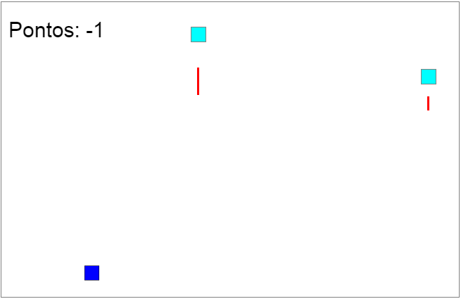

 

    

 

## O que é o m-attack?
**m-attack** é um jogo sem frameworks direto no navegador com html, js e Canvas parecido com o jogo Megamania da Atari.

 

## O que significa o nome M-Attack?
- O nome originalmente era "m2" que tinha o significado a ideia da medida que corresponde a um quadrado com um metro de comprimento em cada lado.  O conceito de metro quadrado ou m2 é bastante utilizado para calcular o tamanho de uma área.  Por isso, é aplicado na verificação da área de imóveis, ambientes e terrenos. Assim como, tem sentido e é aplicado a qualquer jogo. Pensei em um nome sugestivo e m2 parecia fazer sentido já que parte do jogo necessita disso para funcionar.  Mas em parte m2 é uma alusão ao nome do robô do Star Wars: R2-D2.
- Porém, talvez m2 iria confundir com os processadores da Apple na hora de pesquisar, e a Apple é bem chata em relação a isso, eles tem uma fama de jogar processo em tudo que pareça com ela. Nesse sentido, renomeamos para m-attack.

 

<h2 align="left"> Imagem do jogo </h2>

  

 

## Licença
- A licença do jogo é da autoria/criação de [MarkusLuan](https://github.com/MarkusLuan) da organização [MkgCriacoes](https://github.com/MkgCriacoes/). Caso queira maiores informações, acesse esse link para o site [mkgcriacoes](https://mkgcriacoes.com.br/).
- A logo desse jogo é licenciada com [Licença Flaticon](https://www.flaticon.com/br/icone-gratis/area_5442086) a autoria/criação da logo é de [Mayor Icons](https://www.flaticon.com/br/autores/mayor-icons). Sua utilização é grátis para uso pessoal e comercial com atribuição.
- O jogo está sendo desenvolvido com a contribuição de [codehangen](https://github.com/codehangen)
